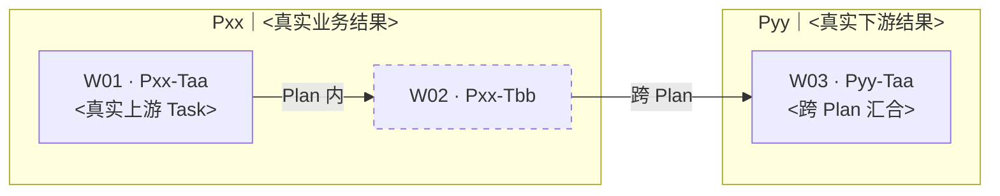

# 复杂实施计划：<business-outcome>

<!--
本文件面向 AI，只在实施包含委派、跨会话、复杂依赖或高写冲突风险的 Task 时创建，一次 Request 最多一份。
简单 Task 保持在 `task_plan.md` inline。T-DAG 中每个复杂节点都定位本文件的同 ID 合同小节；为保持完整拓扑而显示的虚线 inline 节点，定位 `task_plan.md` 的同 ID 小节。节点标签、索引和目标小节 ID 完全一致。
Plan / Task 依赖与波次只由 `task_plan.md` 拥有；这里的 P-DAG、T-DAG 和依赖列都是按已批准版本生成的只读执行视图。拓扑变化必须先更新 `task_plan.md`，再同步本文件；只有变化同时改变用户结果、范围、验收、关键体验、难逆风险、成本/时间承诺或交付目标时才重新批准。
本文件冻结复杂 Task 的输入、写域、DONE、验证和停止条件，不保存实时进展或实际验收结果。
本模板是菜单，不是表单：只生成真实存在的 Plan、Task、边和合同；删除空节、示例节点与无内容字段，不得复制出虚构拓扑。
-->

## 1. P-DAG｜先看业务结果怎样汇合

读图：从左到右；同一列可并行，箭头表示下游必须等待。图严格从 `task_plan.md` 真实拓扑生成；单 Plan 可省略本图。

<!-- 以下只示范语法；生成时用真实节点整体替换，不保留 Pxx/Pyy。 -->

| Plan | 业务结果 | Business DONE | 上游 / 汇合 |
|---|---|---|---|
| [Pxx](task_plan.md#Pxx) | | | — / P… |

## 2. T-DAG｜再看每个 Plan 怎样开工与汇合

读图：Plan 是分组，`Wxx` 是执行波次；同一波次且无连线的节点可并行，箭头表示必须等待。Plan 内边写在组内，跨 Plan 边写在组外。实线节点定位本文件复杂合同，虚线节点定位 `task_plan.md` 的 inline 合同。只显示真实 Task。

<!-- 以下只示范分组、波次、跨 Plan 边和点击语法；生成时整体替换全部占位节点。 -->

| Task | 同 ID 小节 | Plan | 业务摘要 | 依赖（含 inline 边界） | 波次 | 写域 owner |
|---|---|---|---|---|---|---|
| [Pxx-Txx](#Pxx-Txx) | [复杂合同](#Pxx-Txx) / [inline](task_plan.md#Pxx-Txx) | Pxx | | — / P…-T… | Wxx | |

## 3. Task 合同｜按 Plan 分组

每个真实复杂 Task 重复一次合同骨架，并同步 T-DAG、索引和小节 ID。合同只给执行者最小充分上下文，不默认附完整对话、完整 Portfolio、专家讨论或其他 Task 历史。

<!-- 每个真实复杂 Task 重复一次；生成后删除本注释。 -->
### Pxx｜<真实业务结果>

#### Pxx-Txx｜<复杂 Task 业务结果>

- 合同版本 / source fingerprint：C01 / <base-sha-plus-diff-or-artifact-digest>
- 所属 Plan / 覆盖验收：Pxx / R… / A…
- 业务结果 / 明确非范围：
- 责任角色 / 所需能力：
- 输入与精确上下文：`findings.md#…`、`task_plan.md#Pxx`、上游同 ID 返回、`<project-file>#<symbol>`
- 写域：允许修改=<…>；只读=<…>；禁止修改=<…>；唯一写 owner=<…>；共享资源与排队关系=<…>
- 最小实施步骤：<只写执行者开始工作所需的关键动作与顺序，不复述 Plan>
- DONE：
- Fresh 验证：环境=<…>；命令 / 场景=<…>；预期 exit code / 可观察结果=<…>
- 失败 / 回退：<失败后保持或恢复到什么安全状态；由谁接手；哪些结果仍可复用>
- 停止条件：上游未满足 DONE / 写域冲突 / baseline 或版本不一致 / source fingerprint 改变 / 权限不足 / 无法验证 / 范围变化；命中即停止并返回总协调者。
- 返回：实际产物与 diff；命令、exit code 和关键结果；DONE 对照；新事实及来源；偏离、残余风险与具体 gap。

## 4. 合同维护规则

- 派发前核对 findings baseline、task plan version、合同版本和 source fingerprint；不一致时先失效或升级受影响合同。
- Plan / Task 依赖、波次或汇合关系变化时，先修改 `task_plan.md`；本文件只同步派生图、索引和受影响合同。
- 复杂 Task 的完整合同只在本文件；`task_plan.md` 只保留业务索引和本小节链接。
- 执行者不得修改本文件；总协调者根据事实变化更新并重新派发最小上下文。
- 实际进展与验收记录只写 `progress.md`。
