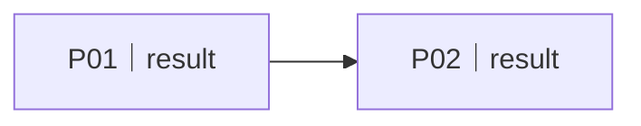

# 完整方案与交付编排：<business-result>

<!--
本文件是给人确认的完整业务方案，也是多 Plan / Task 顶层编排的唯一真源。默认一个 Request 一份，不按 Plan 机械拆文件。
它保存批准方案、Plan/Task 定义、依赖、写域和验收，不保存运行 stage/status、blocker、执行流水或实际证据。运行状态只写 progress.md；复杂、委派或跨会话 Task 在派发前按需生成 tasks/<task-id>.md。
`decision` 只描述本版本是否已获批准，不表示执行进度。重大方案变化升级 plan_version 并重新确认；历史由 Git 或项目现有版本机制保留。
-->

## 1. 给人的方案摘要

- 要解决的问题：`request.md` 的 R… / A…
- 推荐方案：
- 方案交付物（不复制 request 的用户结果）：
- 为什么这样做：`findings.md` 的 E… / O…
- 关键取舍与删除项：
- 方案特有删除项（Request 非范围仍以 `request.md` 为准）：
- 需要用户选择：无 / …

## 2. 完整业务与产品方案

- 方案覆盖的端到端旅程（引用 `request.md` 的用户定义，不复制）：
- 业务规则 / 关键状态：
- 功能与非功能边界：
- 数据、接口、身份和集成边界：
- UI / 信息结构 / 视觉 / 动效（适用时）：
- 安全、性能、可靠性、成本与兼容边界：
- 迁移、回滚和失败处理：
- 项目地基缺口与最小补齐：无 / …

## 3. Plan Portfolio

Plan 按可独立验收的业务结果划分，不按用户句子、技术层或目录划分。运行阶段和完成状态不写在这里。

| Plan | 独立业务结果 | 覆盖 Requirement / Acceptance | 输入 | 输出 / Business DONE | 依赖 | 集成点 |
|---|---|---|---|---|---|---|
| P01 | | R01 / A01 | | | — | |

## 4. Task Registry 与冲突预防

规划时先建立 Task ID、所属 Plan、依赖和波次。未生成 Task 文件前，`inline contract` 临时拥有结果、owner、写域、DONE 和验证；复杂、委派、跨会话或存在写冲突风险的 Task 到达 Ready 候选时生成完整合同，并把 inline 细节全部替换为链接。一个 Task 可以更换 Agent，不按 Agent 数量复制文件。

| Task | 所属 Plan | 依赖 | 合同 owner |
|---|---|---|---|
| P01-T01 | P01 | — | `inline: result=…; owner=…; write=…; DONE/verify=…` / `tasks/p01-t01.md` |

并行只在无依赖路径、写域与共享可变资源不冲突、验证环境可并行且收益高于协调成本时成立。同文件不同区域、共享 schema/API、lockfile、migration、生成物和 release candidate 默认合并 owner 或串行。

| Wave / 顺序 | Tasks | 并行依据或串行原因 | 写域 / 资源检查（来自合同 owner） | 汇合门 |
|---|---|---|---|---|
| W01 | P01-T01, P01-T02 | | | P01-T03 |

## 5. 集成与验收矩阵

| 层级 | 覆盖对象 | 验收 / 场景 | Fresh 验证方法 | 失败返回 |
|---|---|---|---|---|
| Task | P01-T01 | | | Task / Plan / Request |
| Plan | P01 | | | |
| Request | A01 | | | |

## 6. 开工确认

- Request baseline：与 frontmatter 一致。
- Plan version：与 frontmatter 一致。
- 用户可读方案已确认：是 / 否；证据：
- 本地实施授权：
- commit / push / merge / deploy / delete / 公开发布授权：
- 方向性未知：无 / …
- 未确认时不得开始 Build；用户确认后把 `decision` 更新为 `approved`。

## 7. 变更规则

- 技术细节调整但不改变用户结果、不变量、主要边界和验收时，可在同一 plan_version 内由 AI 完成并记录依据。
- 用户结果、方案方向、关键边界、Plan 组合或验收改变时，升级 plan_version 并重新确认受影响部分。
- plan_version 改变后，受影响 Task 合同必须失效或升级 contract_version；未受影响 Task 继续。
- 所有实时 stage/status、Ready、Blocker、Feedback 和 evidence index 只在 `progress.md`。
