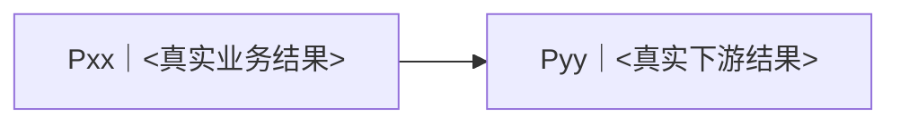

# 最终方案与任务计划：<business-outcome>

<!--
本文件面向人，是最终 PRD、体验方案、范围、Plan Portfolio、Plan DAG、Task 业务索引和正式批准的唯一真源。
它也是 Plan / Task 依赖、波次和汇合拓扑的唯一 owner；其他文件中的 P/T DAG 只能从本文件派生，不得反向决定拓扑。
它不保存执行阶段、工作项状态、等待原因、实际验证结果或工作流水。`plan_mode` 固定为 `formal`；`approval_state` 只表示本版本是否获正式批准，不表示实施进展。正式草案即使尚未落盘，也必须保持相同逻辑状态，不能按文件是否存在降级为简单路径。
复杂、需要委派、跨会话或高冲突风险的实施才创建一份 `implementation-plan.md`；简单 Task 的最小约定留在本文件，不机械建合同。
正式草案只写入用户或宿主提供的一个既有安全计划区，或保留在对话中；批准前不写产品源文件、不为本次实施新建 worktree、不开始实现写入。开工门先复用宿主已提供且满足要求的现场；计划已经位于该现场时不迁移，否则把完全相同的批准内容原子迁入并删除临时草案，不保留两份可编辑副本。
本模板是菜单，不是表单：只保留对当前计划有真实信息的行和章节，删除空字段、空章节、示例节点和不存在的 Plan/Task。不得为了填满模板制造内容。
-->

## 1. 一屏决策

| 决策项 | 已收敛内容 |
|---|---|
| 为谁解决什么 | `findings.md#requirement-confirmation-card` / <一句话> |
| 最终交付结果 | |
| 推荐方案 | |
| 为什么是它 | `findings.md#E… / #I… / #O…` |
| 本次范围 / 非范围 | |
| 怎样算完成 | `findings.md#A…` |
| 关键取舍与安全默认 | |
| 主要风险与回退 | |
| 本次批准内容 | findings baseline + 最终方案 + 范围 + Plan/Task 编排 |

## 2. 最终 PRD 与体验方案

### 用户与业务结果

- 目标用户 / 场景：
- 端到端用户旅程：
- 核心用例与优先级：
- 业务规则、关键状态与边界行为：
- 成功指标 / 可观察结果：

### 产品与系统方案

- 功能能力：
- 数据、接口、身份与集成边界：
- 安全、隐私、性能、可靠性与成本边界：
- 兼容、迁移、失败处理与回滚：
- 项目地基的真实缺口与最小补齐：无 / …

### 体验方案（有界面时）

- 信息架构与主路径：
- 关键页面 / 组件 / 状态：
- 交互反馈与错误恢复：
- 视觉语言与 design tokens：
- 动效与 reduced motion：
- 响应式、无障碍与长内容策略：
- 已选原型 / 线框 / demo 及精确位置：

## 3. 范围与边界

| 范围项 | 决定 | 业务理由 | 验收引用 |
|---|---|---|---|
| <capability> | 本次做 / 本次不做 / 后续候选 | | R01 / A01 |

- 必须守住的不变量：
- 允许 AI 自主决定的可逆实现细节：
- 授权与待决事项唯一真源：`findings.md@B01#authorization`
- 本计划需要的外部动作：无 / <动作与目标；是否已授权只看上方引用>
- 计划批准不会扩大上述授权。

## 4. Plan Portfolio 与 P-DAG

Plan 按可独立验收的业务结果划分，不按用户句子、技术层或目录划分。实际有两个以上 Plan 时生成 P-DAG；单 Plan 只保留摘要和定义。节点 ID 必须与同 ID 小节完全一致并可点击。

<!-- 以下只示范 Mermaid 语法；生成时用真实节点整体替换，不保留 Pxx/Pyy。 -->

| Plan | 独立业务结果 | 覆盖 Requirement / Acceptance | 输入 | 输出 / Business DONE | 依赖 | 集成点 |
|---|---|---|---|---|---|---|
| [Pxx](#Pxx) | | R… / A… | | | — / P… | |

<!-- 每个真实 Plan 重复一次；删除本注释。 -->

### Pxx｜<真实业务结果>

- 用户可感知结果：
- Business DONE：
- 与其他 Plan 的边界 / 汇合条件：

## 5. Task 业务索引

索引只保留 Task ID、业务摘要、所属 Plan、依赖、波次与合同位置。简单 Task 的最小 inline 合同写在本节同 ID 小节；复杂 Task 只链接 `implementation-plan.md` 的同 ID 小节，不双写合同。

| Task | 业务摘要 | Plan | 依赖 | 波次 | 执行约定 |
|---|---|---|---|---|---|
| [Pxx-Txx](implementation-plan.md#Pxx-Txx) | | Pxx | — / P…-T… | Wxx | [复杂合同](implementation-plan.md#Pxx-Txx) / [inline](#Pxx-Txx) |

并行只在无依赖路径、写域和共享资源不冲突、验证环境可并行且收益为正时成立。同文件不同区域、共享 schema/API、lockfile、migration、生成物和 release candidate 默认合并 owner 或串行。

<!-- 只为真实简单 Task 重复本节；复杂 Task 不在这里复制合同。 -->

### Pxx-Txx｜<简单 Task inline>

- 业务结果：
- 输入 / 精确引用：
- Owner / 写域：
- DONE / Fresh 验证：
- 非范围：
- 停止条件：上游决定缺失 / 写域冲突 / 版本或输入改变 / 权限不足 / 无法验证 / 范围变化；命中即停止并返回总协调者。

## 6. 集成与验收矩阵

| 层级 | 覆盖对象 | 验收 / 场景 | Fresh 验证方法 | 失败返回 |
|---|---|---|---|---|
| Task / Plan / 跨 Plan / Request | <真实对象> | | | 01 / 02 / 03 / 04 / 05 |

## 7. 正式批准

- Findings baseline：与 frontmatter `findings_baseline` 一致。
- Plan version：与 frontmatter `plan_version` 一致。
- Plan mode：固定为 `formal`；不得因草案只存在于对话而改成 inline。
- Planning target ref：与 frontmatter `planning_target_ref` 一致。
- Planning source fingerprint：与 frontmatter `planning_source_fingerprint` 一致。
- 建议隔离：复用宿主现有现场 / 当前安全工作区 / 新建 Request branch + worktree / 其他；理由：…
- 写域与共享资源摘要：<精确 owner / 冲突处理>。
- 授权与待决事项：只引用 `findings.md@B01#authorization`；存在未关闭方向性未知时不得批准。
- 批准对象：需求 baseline、最终 PRD / 体验、范围、Plan Portfolio、P-DAG、Task 业务索引与验收矩阵。
- 批准结论：与 frontmatter `approval_state` 一致，为 draft / approved / rejected / modified。
- 批准人及原话 / 可追溯位置：
- 批准时间：
- 开工门：只有 `approval_state: approved` 才确认相称实现现场并开始执行建设；优先复用宿主现场，只有计划尚未位于该唯一现场时才原子迁移。本文件是否已经落盘不能替代批准判断。
- 外部动作：计划批准不授权 commit / push / merge / deploy / delete / 公开发布 / 生产写入。

## 8. 计划变更规则

- 用户结果、范围、验收、关键体验、难逆风险、成本/时间承诺或交付目标改变时，升级 `plan_version`，把 `approval_state` 设为 `modified`，并只重新批准受影响部分。
- Task 拆合、依赖/波次、写域、owner、验证方式或其他不改变上述业务契约的可逆实现变化，先更新本文件的拓扑/矩阵，再同步 `implementation-plan.md` 的派生图与受影响合同；不重新请求批准。
- planning target / source fingerprint 变化必须经过开工门或阶段复核；按上面两类变化决定是否升级批准，不以任何漂移机械打断用户。
- 版本改变后，受影响的复杂 Task 合同必须失效或升级；未受影响 Task 继续。
- 所有实时进展和验收记录只写 `progress.md`。
