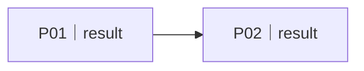

# 用户计划：<business-title>
<!-- 唯一范围与状态真源。证据理由见 findings；技术步骤见 implementation-plan；实际结果见 progress。删除不适用章节。 -->

## Current Snapshot

- 当前阶段：需求澄清 / 选定方案 / 拆成任务 / 执行任务 / 验收交付 / 提炼经验 / 回灌改进
- 当前范围：待确认 / 已确认；纳入/暂缓哪些 Plan
- 活跃 Plan / Task：
- 最近完成：
- 下一步：
- Blocker：无 / Bxx
- 必跑验证：
- 当前风险：

## 阶段成果路由

每个已完成阶段最多一个活动入口；目标类型只允许 `document / visual / collection`，只保存项目相对路径。没有当前有效成果时不填占位行；上游变化后删除受影响的下游活动入口，历史证据留在 findings/progress。

| 阶段 | 目标类型 | 项目相对入口 |
|---|---|---|

## 1. 需求与边界

- 目标用户 / 场景：
- 期望业务结果：
- 关键约束：
- 明确非范围：
- 仍需用户纠正的理解：无 / …

## 2. 现状诊断

| ID | 差距 | 业务影响 | 判断 | findings 证据 |
|---|---|---|---|---|
| D01 | | | | E01 |

## 3. 验收标准

- 整体用户结果：
- 关键场景 / 边界：
- 跨 Plan 集成：
- 证据要求：实际输出只写 progress。

## 4. Plan Portfolio

状态只允许 `pending / in_progress / completed / blocked`；ID 只用于引用，不代表优先级。

#### P01｜<business-result>

- 价值 / 解决的问题：
- 交付结果：
- 前置依赖：— / Pxx
- 业务 DONE：
- 范围决定：待确认 / 纳入 / 暂缓 / 不做
- 状态：pending

### 范围决策

| Plan | 必要性 | AI 建议 | 不做的损失 | 当前决定 |
|---|---|---|---|---|
| P01 | 必做 / 推荐 / 可选 | 纳入 / 暂缓 / 不做 | | 待确认 |

### Plan DAG

## 5. Task Register

Ready 由“范围纳入 + 依赖 completed + 无 blocker + 授权具备”实时计算，不作为第五种状态。

| Task | 用户价值 / 产物 | 依赖 | 文件域 / 共享资源 | 上下文引用 | DONE / 验证 | 状态 |
|---|---|---|---|---|---|---|
| P01-T01 | | — | | `findings:E01`; `implementation:P01-T01` | | pending |

## 6. 执行门槛
- 目标和边界已经看清；方案已经选定。
- UI 范围已有体验契约；非 UI 已记录不适用。
- Plan 范围已确认，依赖和 blocker 已闭合；每个 Task 有 owner、边界、DONE 和验证。
- 用户对“实施”的授权不自动包含 commit、push、merge、deploy、delete 或公开 release。

## Blockers

| ID | Plan / Task | 阻断事实 | 所需输入 / owner | 解锁证据 |
|---|---|---|---|---|

## Completed milestones

| Plan | 业务结果 | 交付状态 | progress 证据 | 完成时间 |
|---|---|---|---|---|

## 真源链接

- `findings.md`：证据与为什么。
- `implementation-plan.md`：复杂任务怎么做；不保存状态。
- `progress.md`：实际发生、验证和 handoff。
